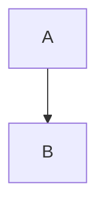

# A Rusty Compiler (WIP)

Compiling C code to Assembly with a Rust-written compiler

## Grammar

```
<type>        := int
               | char
               | float
               | double
               | void
<literal>     := number | string | true | false
<expression>  := <literal> | <identifier>
<assignment>  := <type> <identifier> = <expression>
<return>      := return <expr>
<instruction> := (<assignment> | <return>) ;


<function>    := <type> <identifier>(void) { instruction* }
<program>     := <function>*
```

## Organization


